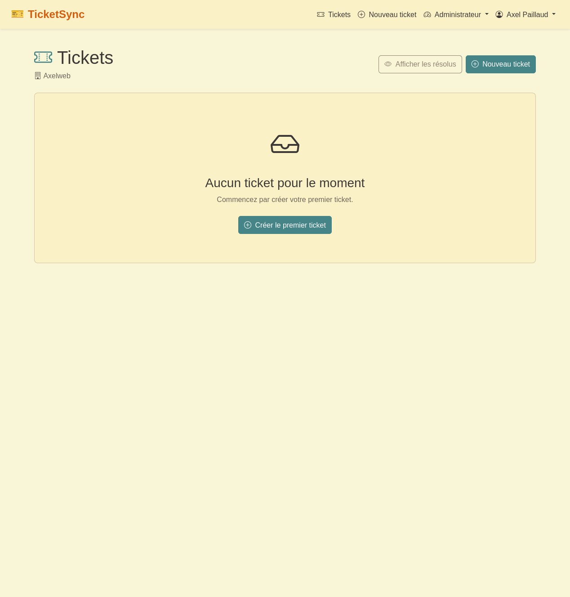
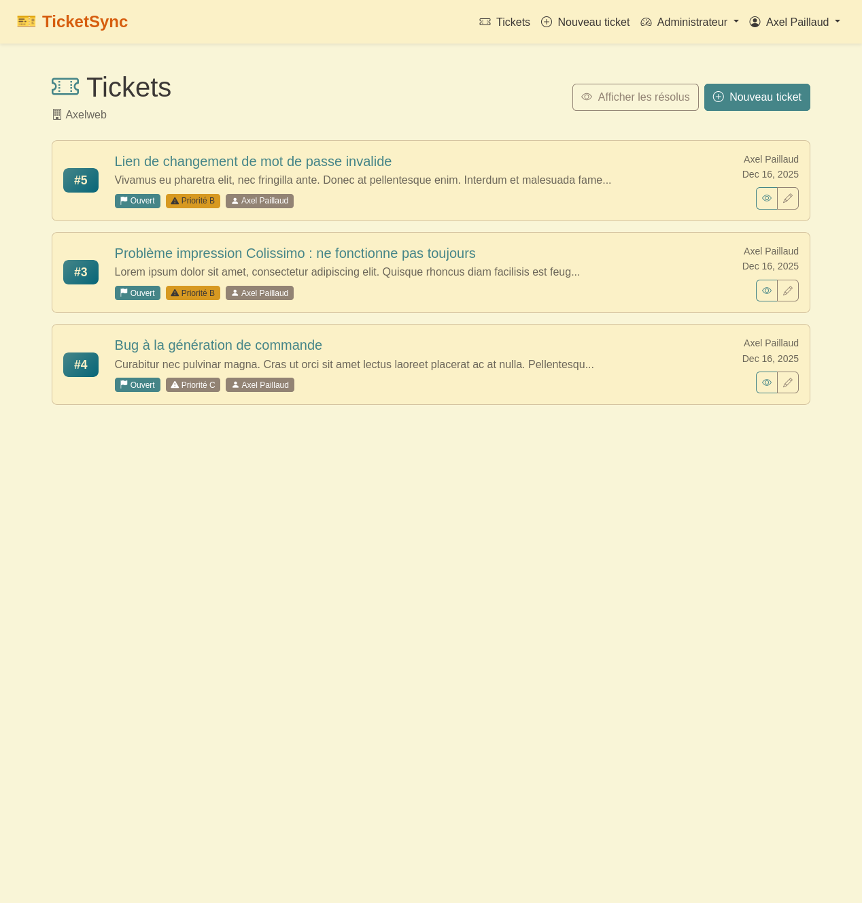
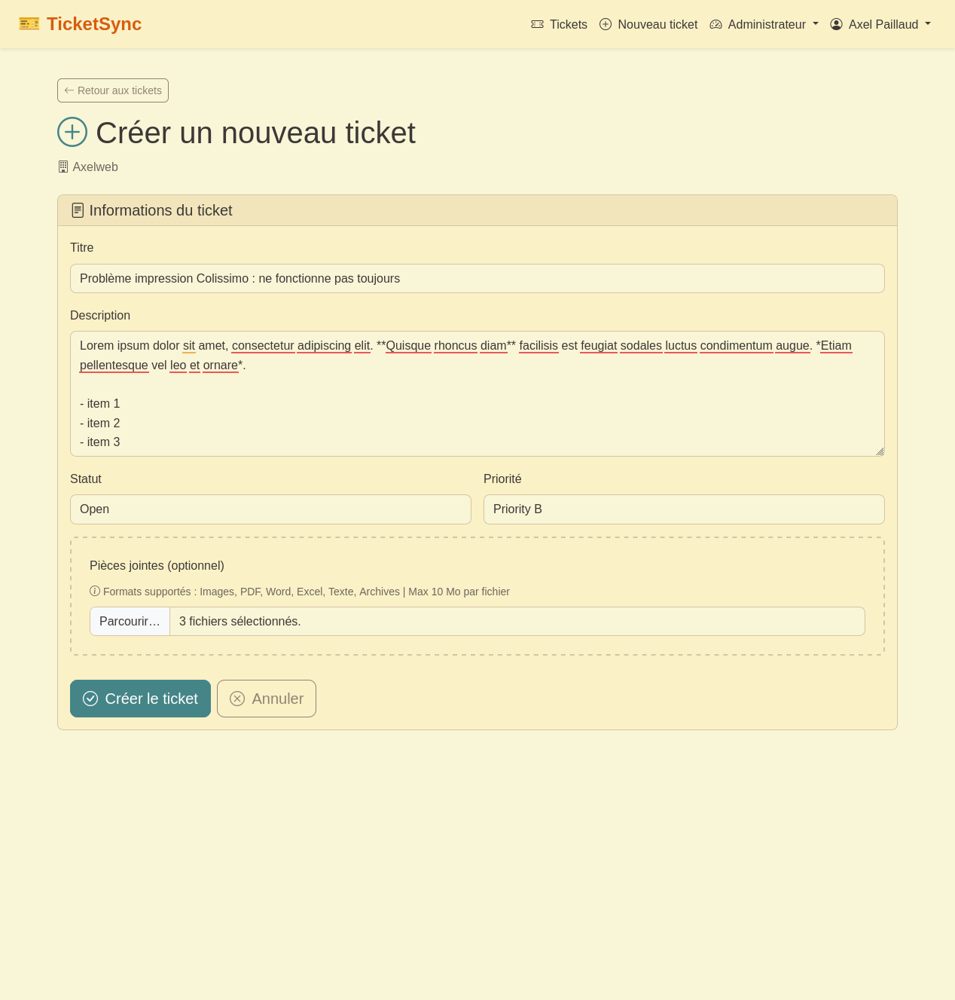
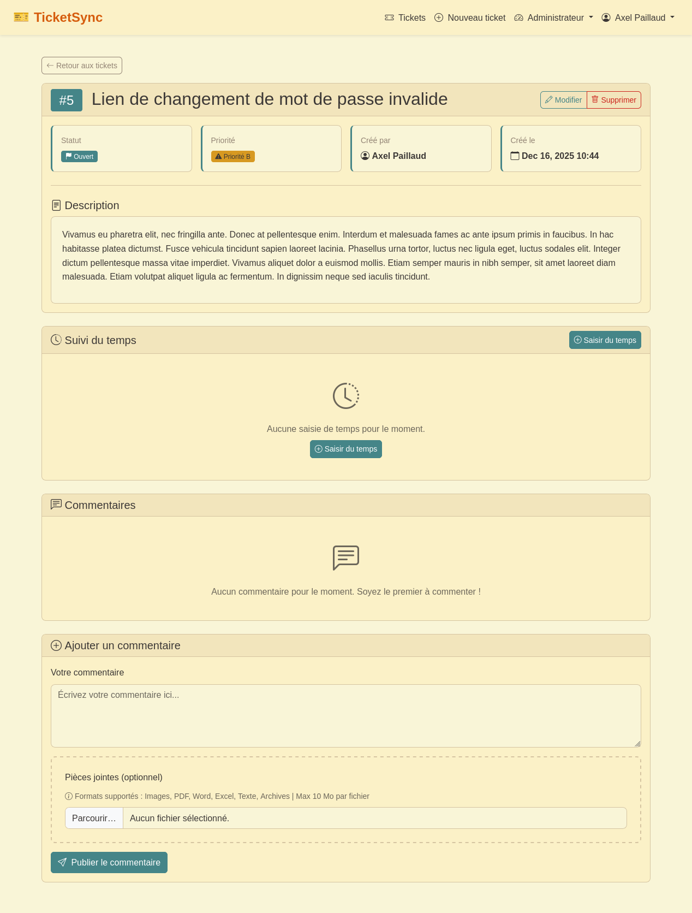

# TicketSync - Guide Utilisateur

## Introduction

TicketSync est un système de gestion de tickets multi-organisation permettant de gérer les demandes clients de manière efficace.

Chaque organisation dispose de son propre espace isolé avec ses utilisateurs, tickets et données.

### Fonctionnalités principales

- Création et gestion de tickets avec statuts et priorités
- Système de commentaires avec pièces jointes
- Notifications email automatiques
- Suivi du temps passé sur les tickets
- Gestion multi-utilisateurs avec rôles

---

## Connexion

### Première connexion

Si vous avez reçu une invitation par email, cliquez sur le lien fourni pour créer votre compte.

Vous devrez :

- Définir votre mot de passe
- Accepter l'invitation à rejoindre l'organisation

### Connexion standard

Rendez-vous sur la page de connexion et saisissez vos identifiants.

Une fois connecté, vous accédez automatiquement à votre organisation.



---

## Gestion des Tickets

### Vue d'ensemble

La page principale affiche la liste de tous les tickets de votre organisation.

Pour chaque ticket, vous pouvez voir :

- Le titre et la description
- Le statut actuel (Nouveau, En cours, Résolu, Fermé)
- La priorité (Basse, Moyenne, Haute, Critique)
- L'utilisateur assigné
- La date de création



### Créer un nouveau ticket

Cliquez sur le bouton "Nouveau ticket" en haut de la liste.

Remplissez le formulaire avec :

- **Titre** : Résumé court du problème
- **Description** : Détails complets (supporte le Markdown)
- **Statut** : État initial du ticket
- **Priorité** : Niveau d'urgence
- **Pièces jointes** : Fichiers à joindre (optionnel)



Les types de fichiers supportés sont :

- Images (PNG, JPG, GIF, WebP)
- Documents (PDF, Word, Excel)
- Archives (ZIP)
- Fichiers texte

Taille maximale : 10 MB par fichier.

### Consulter un ticket

Cliquez sur un ticket dans la liste pour voir tous les détails.

La page affiche :

- Les informations complètes du ticket
- L'historique des commentaires
- Les pièces jointes
- Les entrées de temps enregistrées



### Modifier un ticket

Sur la page d'un ticket, cliquez sur "Modifier" pour changer :

- Le titre ou la description
- Le statut (déclenche une notification email)
- La priorité
- L'utilisateur assigné
- Ajouter ou supprimer des pièces jointes

Vous pouvez modifier un ticket si :

- Vous êtes l'auteur du ticket
- Vous êtes administrateur

### Supprimer un ticket

La suppression d'un ticket est définitive et supprime également :

- Tous les commentaires associés
- Toutes les pièces jointes
- Toutes les entrées de temps

Seuls les administrateurs peuvent supprimer des tickets.

---

## Commentaires

### Ajouter un commentaire

En bas de la page d'un ticket, utilisez le formulaire pour ajouter un commentaire.

Vous pouvez :

- Écrire du texte (supporte le Markdown)
- Joindre des fichiers


Tous les utilisateurs de l'organisation reçoivent une notification email lorsqu'un nouveau commentaire est ajouté.

### Modifier un commentaire

Cliquez sur "Modifier" à côté de votre commentaire.

Vous pouvez modifier :

- Le texte du commentaire
- Ajouter ou supprimer des pièces jointes

Seuls l'auteur du commentaire et les administrateurs peuvent le modifier.

### Supprimer un commentaire

Cliquez sur "Supprimer" à côté du commentaire.

La suppression est définitive et supprime également les pièces jointes associées.

---

## Pièces Jointes

### Télécharger un fichier

Cliquez sur le nom du fichier ou sur l'icône de téléchargement.

Le fichier est téléchargé directement dans votre navigateur.

### Aperçu des images

Les images sont affichées directement dans l'interface avec une miniature.

Cliquez sur l'image pour la voir en taille réelle.

### Supprimer une pièce jointe

Lors de l'édition d'un ticket ou commentaire, cochez la case "Supprimer" sous le fichier concerné.

La suppression est effective après validation du formulaire.

---

## Suivi du Temps

### Enregistrer du temps

Sur la page d'un ticket, cliquez sur "Ajouter du temps".

Renseignez :

- **Durée** : Temps passé (en heures, ex: 2.5)
- **Description** : Ce qui a été fait
- **Date** : Date de l'activité

Les entrées de temps sont visibles par tous les membres de l'organisation.

### Consulter le temps passé

Le temps total est affiché sur la page du ticket.

Cliquez sur "Voir les détails" pour voir toutes les entrées avec :

- L'utilisateur
- La durée
- La description
- La date

---

## Notifications Email

Vous recevez automatiquement des emails pour :

- **Nouveau ticket** : Quand un ticket est créé dans votre organisation
- **Nouveau commentaire** : Quand quelqu'un commente un ticket
- **Changement de statut** : Quand le statut d'un ticket change

Les emails contiennent un lien direct vers le ticket concerné.

Vous ne recevez pas de notification pour vos propres actions.

---

## Profil Utilisateur

### Modifier votre profil

Cliquez sur votre nom en haut à droite, puis "Profil".

Vous pouvez modifier :

- Votre nom
- Votre email
- Votre mot de passe

### Changer de mot de passe

Dans votre profil, utilisez le formulaire "Changer le mot de passe".

Saisissez :

- Votre mot de passe actuel
- Votre nouveau mot de passe
- Confirmation du nouveau mot de passe

---

## Astuces et Bonnes Pratiques

### Utilisation du Markdown

Les champs de description (tickets et commentaires) supportent le Markdown.

Exemples d'utilisation :

```markdown
# Titre principal
## Sous-titre

**Texte en gras**
*Texte en italique*

- Liste à puces
- Deuxième élément

1. Liste numérotée
2. Deuxième élément

```

[Site Markdown Guide](https://www.markdownguide.org/basic-syntax/) pour en savoir plus.

### Organisation des tickets

Pour une meilleure organisation :

- Utilisez des titres clairs et descriptifs
- Définissez la priorité de manière cohérente
- Ajoutez des commentaires pour le suivi

### Gestion des priorités

Recommandations pour les priorités :

- **Priorité A** : Bloquant, nécessite une action immédiate
- **Priorité B** : Normal, peut attendre quelques jours
- **Priorité C** : Améliorations, suggestions

### Communication efficace

Dans les commentaires :

- Soyez précis et concis
- Joignez des captures d'écran si nécessaire
- Mentionnez les informations importantes

---

## Interface Administrateur

Les utilisateurs avec le rôle **ADMIN** ont accès à des fonctionnalités supplémentaires.

### Accès global

Les administrateurs peuvent accéder à tous les tickets de toutes les organisations via `/admin`.

Cette vue centralisée permet de :

- Voir tous les tickets du système
- Filtrer par organisation
- Accéder aux statistiques globales

### Gestion des organisations

Les administrateurs peuvent :

- Créer de nouvelles organisations
- Modifier les informations (nom, slug)
- Voir la liste des utilisateurs par organisation

### Gestion des utilisateurs

Les administrateurs ont accès à la liste complète des utilisateurs.

Ils peuvent :

- Voir les informations de tous les utilisateurs
- Modifier les profils
- Inviter de nouveaux utilisateurs
- Gérer les rôles

### Invitations

Pour inviter un nouvel utilisateur :

1. Accéder à la section "Invitations"
2. Saisir l'email et sélectionner l'organisation
3. Envoyer l'invitation

L'utilisateur reçoit un email avec un lien pour créer son compte et rejoindre l'organisation.

### Permissions étendues

Les administrateurs peuvent :

- Modifier tous les tickets (y compris ceux des autres)
- Supprimer tous les tickets et commentaires
- Accéder aux données de toutes les organisations
- Voir les statistiques globales du système

---

## Support Technique

Pour toute question ou problème concernant l'utilisation de TicketSync, contactez [contact@axelweb.fr](contact@axelweb.fr).

En cas de bug ou suggestion d'amélioration, vous pouvez :

- Créer un ticket dans le système
- Contacter directement l'équipe technique

Nous sommes preneur de toutes suggestions d'améliorations, il s'agit de la première version de l'application !

---

## Informations Techniques

### Formats de fichiers

Types de fichiers acceptés pour les pièces jointes :

- **Images** : PNG, JPG, JPEG, GIF, WebP
- **Documents** : PDF, DOC, DOCX, XLS, XLSX
- **Texte** : TXT, CSV, MD
- **Archives** : ZIP

Taille maximale : 10 MB par fichier.

### Sécurité

Toutes les communications sont sécurisées (HTTPS).

Les fichiers sont stockés de manière sécurisée et accessibles uniquement aux membres de votre organisation.

Les mots de passe sont chiffrés et ne peuvent pas être récupérés (uniquement réinitialisés).

---

**Version** : 1.0
**Dernière mise à jour** : Décembre 2025
